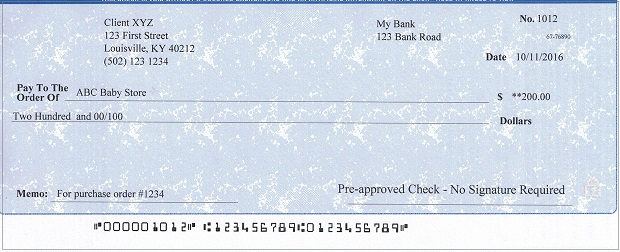

# Excella STX Scanner support for Node.js

A Node.js library for interfacing with MagTek's Excella STX check scanner. This library provides easy-to-use methods for scanning checks and IDs, extracting MICR data, and retrieving images.

## Installation

```shell
npm install --save excella-scanner
```

## Configuration

The library supports configuration through environment variables:

- `MAGTEK_SCAN_URL` - Scanner endpoint URL (default: `/Excella?DeviceScan`)
- `MAGTEK_DEFAULT_PORT` - Default scanner port (default: `80`)
- `MAGTEK_REQUEST_TIMEOUT` - Request timeout in milliseconds (default: `30000`)

## Usage

Assuming your scanner is configured with IP address 192.168.1.23 and you scan the following check:


```javascript
const Scanner = require('excella-scanner');

const scanner = new Scanner('192.168.1.23', 80);
const data = await scanner.readCheck(true);

/***
 data {
    error:          false,
    routing:        '123456789',
    account:        '123456789',
    number:         '000001012',
    frontimage:     '/chkimage/FRONT100COL24_1.JPG',
    backimage:      '/chkimage/BACK100COL24_2.JPG',
    frontimagedata: <Buffer ...>,
    backimagedata:  <Buffer ...>
  }
***/
```

### Error Handling

```javascript
try {
  const data = await scanner.readCheck(true);
  console.log('Check scanned successfully:', data.routing);
} catch (error) {
  console.error('Failed to scan check:', error.message);
}
```

## API

### Scanner Class

#### Constructor
`new Scanner(host, port)` 
Creates a new instance of the Scanner object.

**Parameters:**
- `host` (string, required) - IP address, hostname, or FQDN of the scanner
- `port` (number, optional) - Scanner port (default: 80 or `MAGTEK_DEFAULT_PORT`)

**Throws:** `Error` if host is not provided or is not a string

#### Methods

##### `readCheck(includeImages = false)`
Causes the scanner to read the current check and return the MICR information, potentially also returning the images.

**Parameters:**
- `includeImages` (boolean, default: false) - Whether to include image data in the response

**Returns:** Promise that resolves to an object with the following properties:
- `error` (boolean) - If true, the scanner cannot confirm that the information is accurate
- `routing` (string) - The MICR routing number
- `account` (string) - The MICR account number
- `number` (string) - The MICR check number
- `frontimage` (string) - The path for the front side image
- `backimage` (string) - The path for the back side image
- `frontimagedata` (Buffer|null) - JPG data of the front side (if includeImages=true)
- `backimagedata` (Buffer|null) - JPG data of the back side (if includeImages=true)

**Throws:** `Error` if the scan operation fails

##### `readID(includeImage = false)`
Causes the scanner to read the current ID and return the image information.

**Parameters:**
- `includeImage` (boolean, default: false) - Whether to include image data in the response

**Returns:** Promise that resolves to an object with the following properties:
- `frontimage` (string) - The path for the front side image
- `imagedata` (Buffer|null) - JPG data of the front side (if includeImage=true)

**Throws:** `Error` if the scan operation fails

##### `readImage(imagePath)`
Retrieves an image from the scanner by its path.

**Parameters:**
- `imagePath` (string) - The path to the image on the scanner

**Returns:** Promise that resolves to a Buffer containing the image data

**Throws:** `Error` if the image retrieval fails

## Examples

### Basic Check Scanning
```javascript
const scanner = new Scanner('192.168.1.23');
const data = await scanner.readCheck();
console.log(`Routing: ${data.routing}, Account: ${data.account}, Number: ${data.number}`);
```

### Check Scanning with Images
```javascript
const scanner = new Scanner('192.168.1.23');
const data = await scanner.readCheck(true);
// data.frontimagedata and data.backimagedata contain Buffer objects
```

### ID Scanning
```javascript
const scanner = new Scanner('192.168.1.23');
const data = await scanner.readID(true);
// data.imagedata contains the ID image as a Buffer
```

### Custom Configuration
```javascript
// Using environment variables
process.env.MAGTEK_REQUEST_TIMEOUT = '60000'; // 60 second timeout
const scanner = new Scanner('192.168.1.23', 8080);
```

## Error Handling

The library throws descriptive errors for various failure scenarios:
- Invalid host configuration
- Network timeouts
- XML parsing errors
- Scanner communication failures

Always wrap scanner operations in try-catch blocks for production use.

## Testing

```bash
npm test
```

## License

MIT
